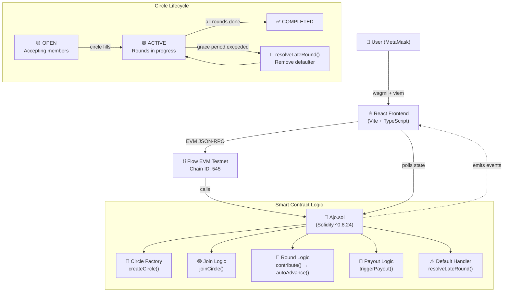
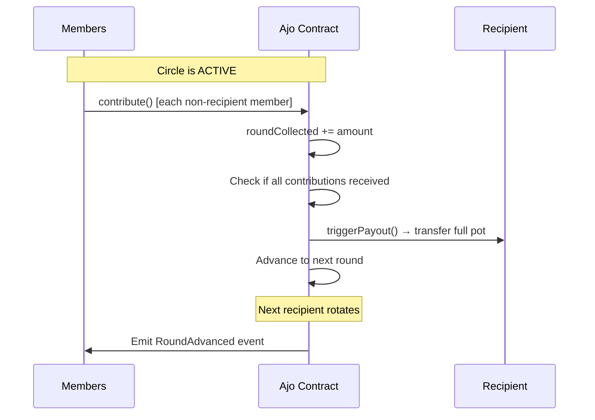
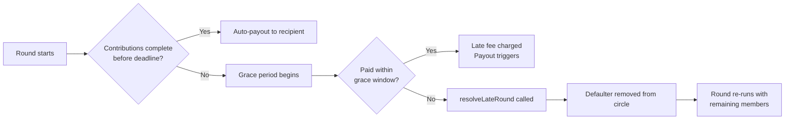

# Ajo — Decentralized Savings Circles on Flow

> **The oldest coordination primitive, rebuilt as a trust-minimized on-chain financial app.**

[](https://evm-testnet.flowscan.io)
[](https://soliditylang.org/)
[](LICENSE)
[](https://plgenesis.com)

---

<!-- BANNER IMAGE PLACEHOLDER -->
<!-- Replace with:  -->
> 📸 _[Banner image placeholder — add a 1200×630 hero image here]_

---

## Table of Contents

- [What is Ajo?](#what-is-ajo)
- [Why Ajo?](#why-ajo)
- [Demo](#demo)
- [Architecture](#architecture)
- [Core Features](#core-features)
- [Smart Contract Highlights](#smart-contract-highlights)
- [Tech Stack](#tech-stack)
- [Live Deployment](#live-deployment)
- [Project Structure](#project-structure)
- [Quick Start](#quick-start)
- [Environment Variables](#environment-variables)
- [Running Tests](#running-tests)
- [Hackathon Alignment](#hackathon-alignment)
- [Roadmap](#roadmap)
- [License](#license)

---

## What is Ajo?

**Ajo** is a decentralized rotating savings circle — known globally as a ROSCA (Rotating Savings and Credit Association) or *tontine* — built on **Flow EVM Testnet**.

A savings circle is simple: a group of people agree to each contribute a fixed amount every period. Each round, one member receives the entire pot. Everyone saves. Everyone gets paid out. No bank required.

Ajo takes this centuries-old community practice and puts it fully on-chain:

- No trusted admin
- No spreadsheet reconciliation
- No manual payouts
- Just code, automation, and community

---

## Why Ajo?

Savings circles are already practiced by hundreds of millions of people worldwide — from West Africa's *Ajo* and *Esusu*, to East Asia's *Hui*, to Latin America's *Tandas*. These communities already understand the mental model.

The problem isn't the concept. The problem is the trust layer — someone always has to hold the money, track the rounds, and handle defaulters.

Ajo eliminates that trust problem entirely. The contract holds the funds, the contract runs the rounds, and the contract resolves defaults. All participants need is a wallet.

---

## Demo

<!-- DEMO VIDEO PLACEHOLDER -->
<!-- Replace with: [](https://youtube.com/your-demo-link) -->
> 🎬 _[Demo video placeholder — embed your YouTube demo link here]_  
> `[](https://youtube.com/watch?v=YOUR_VIDEO_ID)`

<!-- LIVE DEMO SCREENSHOT PLACEHOLDER -->
<!-- Replace with:  -->
> 📸 _[App screenshot placeholder — add dashboard screenshot here]_

**Live Demo:** _[Add your deployed frontend URL here]_

---

## Architecture

### System Overview



### Round Flow



### Late / Default Handling



---

## Core Features

| Feature | Description |
|---|---|
| **Create a Circle** | Set contribution amount, round duration, and max members |
| **Join a Circle** | Browse open circles and join with one transaction |
| **Auto-Start** | Circle activates automatically when membership fills |
| **Auto-Payout** | Payout triggers automatically once all contributions are in |
| **Rotating Recipients** | Every member gets the pot exactly once, in rotation |
| **Late Fees** | Configurable late fee (BPS) for delayed contributions |
| **Grace Period** | Window for late payers before defaulter resolution kicks in |
| **Defaulter Resolution** | `resolveLateRound()` removes a defaulter after grace period |
| **Recipient Exemption** | Recipient does not contribute in their own payout round |
| **Real-time Dashboard** | Live round status, countdown timers, contribution progress |

---

## Smart Contract Highlights

**Contract:** `contracts/Ajo.sol`

```
Key mechanisms:
├── Circle lifecycle management (Open → Active → Completed)
├── Per-round accounting via roundCollected mapping
├── Late fee configuration (LATE_FEE_BPS constant)
├── Grace period enforcement (GRACE_PERIOD constant)
├── resolveLateRound() — recovery function for stalled rounds
├── Recipient-aware contribution rules (exempt in own round)
└── Reentrancy protection on all external fund-moving functions
```

**Test coverage** (`test/`) validates:
- Circle creation with various parameters
- Member join flow and capacity enforcement
- Round advancement and payout logic
- Late fee calculation and application
- Defaulter removal and round recovery

---

## Tech Stack

### Smart Contracts
- **Solidity** `^0.8.24`
- **Hardhat** — compile, test, deploy
- **OpenZeppelin** — security primitives (ReentrancyGuard)

### Frontend
- **React** + **Vite** + **TypeScript**
- **wagmi** + **viem** — EVM wallet connection and contract interaction
- **Three.js** / **React Three Fiber** — immersive UI experience layer
- **Framer Motion** — interaction animations

### Infrastructure
- **Flow EVM Testnet** — deployment target (Chain ID: 545)
- **MetaMask** — wallet integration

---

## Live Deployment

| Property | Value |
|---|---|
| **Network** | Flow EVM Testnet |
| **Contract Address** | `0x8a1515Bce4Fb424343E8187959dF197cB33Fc1b9` |
| **Block Explorer** | [evm-testnet.flowscan.io](https://evm-testnet.flowscan.io) |
| **RPC URL** | `https://testnet.evm.nodes.onflow.org` |
| **Chain ID** | `545` |

---

## Project Structure

```
Ajo/
├── contracts/
│   └── Ajo.sol              # Core ROSCA smart contract
├── deploy/
│   └── deploy.ts            # Hardhat deployment script
├── test/
│   └── Ajo.test.ts          # Full test suite
├── frontend/
│   ├── src/
│   │   ├── components/      # UI components
│   │   ├── hooks/           # wagmi contract hooks
│   │   ├── pages/           # App pages (Home, Circle, Dashboard)
│   │   └── main.tsx         # App entry point
│   └── .env                 # Frontend environment config
├── hardhat.config.ts
├── package.json
└── .env.example
```

---

## Quick Start

### Prerequisites

- Node.js **v20 LTS**
- MetaMask (or compatible EVM wallet)
- Flow EVM Testnet FLOW for gas — get testnet FLOW from the [Flow faucet](https://testnet-faucet.onflow.org/)

### Install & Run

```bash
# Clone the repository
git clone https://github.com/jerrygeorge360/Ajo.git
cd Ajo

# Install root dependencies
npm install

# Compile contracts
npm run build

# Run tests
npm test

# Start the frontend dev server
npm run dev
```

The frontend will be available at `http://localhost:5173`.

---

## Environment Variables

**Root `.env`** (for contract deployment):

```bash
PRIVATE_KEY=0x...your_deployer_private_key...
VITE_RPC_URL=https://testnet.evm.nodes.onflow.org
```

**`frontend/.env`** (for the dApp UI):

```bash
VITE_CONTRACT_ADDRESS=0x8a1515Bce4Fb424343E8187959dF197cB33Fc1b9
VITE_RPC_URL=https://testnet.evm.nodes.onflow.org
```

Copy `.env.example` to `.env` and fill in your values.

---

## Running Tests

```bash
# Run all contract tests
npm test

# Run with verbose output
npx hardhat test --verbose
```

Test coverage includes circle creation, join enforcement, round advancement, payout triggers, late fee math, and defaulter resolution.

---

## Hackathon Alignment

### Flow: The Future of Finance (Consumer DeFi)

Ajo directly addresses the Flow Consumer DeFi challenge:

- **Intuitive UX** — the savings circle mental model is universally understood, no crypto jargon required
- **Automation-first** — rounds auto-start, auto-pay, and auto-recover from defaults without manual intervention
- **EVM-native on Flow** — written in Solidity, deployed with Hardhat, frontend uses wagmi/viem — proving Flow is welcoming to EVM teams
- **Real financial utility** — solves a genuine coordination problem for communities that already practice ROSCAs

### Protocol Labs — Crypto Track

Ajo aligns with the Crypto track's vision of new economic coordination systems:

- Programmable group savings with trustless enforcement
- Automated round-by-round payout logic
- On-chain transparency and auditability for every contribution and payout
- Savings circles (digital tontines) are explicitly listed as an example use case in the Crypto track

### Fresh Code

This is a **fresh code** submission built specifically for PL_Genesis.

---

## Roadmap

Planned enhancements for production Consumer DeFi:

- [ ] **Walletless onboarding** — email and passkey login via account abstraction
- [ ] **Sponsored gas** — first-time users pay zero fees
- [ ] **Autopilot contributions** — schedule automatic contributions via rules
- [ ] **Natural-language intents** — "add me to a 5-person circle, 10 FLOW per round"
- [ ] **Trust scoring** — on-chain reputation for reliable circle members
- [ ] **Mobile-first PWA** — installable on Android and iOS
- [ ] **Multi-token support** — stablecoins alongside native FLOW

---

## License

MIT © 2025 — [jerrygeorge360](https://github.com/jerrygeorge360)